# RWAPSSF
smart contract ที่ผู้ใช้งานสามารถเล่นพนันในเกมส์ที่มีกฏเกณฑ์การแพ้ ชนะ และเสมอ ตายตัว และจะมีการจ่ายเงิน ETH ไปให้กับผู้ที่ชนะ หรือแบ่งเงินในกรณีเสมอ

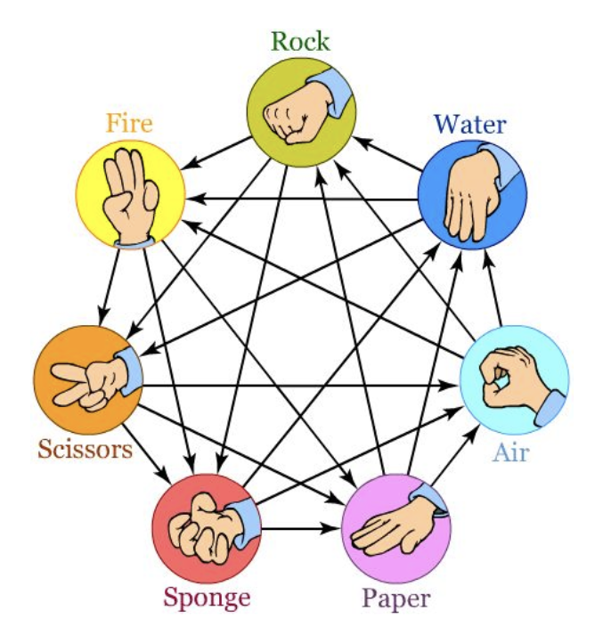

## วิธีการเล่น

1. ผู้ที่ต้องการเล่นเรียก function addPlayer พร้อมเงินเดิมพัน 1 ETH ใน 1 รอบต้องการผู้เล่น 2 คน กรณีมีผู้เล่นไม่ครบภายใน 1 ชั่วโมง ผู้เล่นที่วางเดิมพันไว้สามารถถอนเงินของตนเองได้ด้วยการเรียก function withdraw
2. เมื่อมีผู้เล่นครบ 2 คน ผู้เล่นจะต้องเลือก choice ที่จะเป็นตัวตัดสินผลแพ้ชนะ ด้วยการเรียก function input
      
    0 - rock, 1 - water, 2 - air, 3 - paper, 4 - sponge, 5 - scissors, 6 - fire

    พร้อมกรอก salt ที่กำหนดโดยผู้เล่น เป็นเหมือนรหัสที่ผู้เล่นจะต้องใช้ในการเปิดเผย choice 

    กรณีผู้เล่นทั้ง 2 คนไม่เลือก choice หลังจากผู้เล่นครบภายใน 1 ชั่วโมง การเดิมพันจะถือเป็นโมฆะ ผู้เล่นสามารถเรียก function withdraw เพื่อถอนเงินส่วนของตนเองได้

    กรณีมีผู้เล่นคนหนึ่งไม่เลือก choice หลังจากผู้เล่นครบภายใน 1 ชั่วโมง ผู้เล่นที่เลือก choice แล้วจะสามารถถอนเงินเดิมพันทั้งหมดไปได้เลยด้วยการเรียก function withdraw

3. เมื่อผู้เล่นทั้งสองคนเลือก choice แล้ว จะมีการตัดสินผลแพ้-ชนะ-เสมอ 
    - กรณีผลเสมอ เงินเดิมพันจะถูกแบ่งครึ่งแล้วโอนไปยังบัญชีของผู้เล่นแต่ละคนทันที 
    - กรณีมีผู้ชนะ ผู้ชนะจะต้องเปิดเผย choice ที่เลือกด้วยการเรียก function revealChoice พร้อมกรอกค่า salt ที่ถูกต้อง เงินเดิมพันทั้งหมดจึงจะถูกโอนไปยังบัญชีผู้ชนะ
    - หากผู้ชนะไม่เปิดเผยหรือไม่สามารถเปิดเผย choice ได้ภายใน 1 ชั่วโมงหลังจากตัดสินผล การเดิมพันจะถือเป็นโมฆะ ผู้เล่นหนึ่งคนสามารถเรียก function withdraw เพื่อแบ่งครึ่งเงินเดิมพันแล้วโอนไปยังบัญชีของผู้เล่นแต่ละคน

## การแก้ไขปัญหา

### ปัญหา front-running
- ใช้กระบวนการ commit-reveal โดยเมื่อผู้เล่นเลือก choice ผู้ใช้จำเป็นต้องกรอก salt ที่จะใช้ในการคำนวณ hash ของ choice จากนั้นจะมีการ commit ไว้ หลังจากการตัดสินผล กรณีมีผู้ชนะ ผู้ชนะจำเป็นต้องเปิดเผย choice เพื่อรับเงินเดิมพัน หากไม่เปิดเผยภายใน 1 ชั่วโมง การเดิมพันจะถือเป็นโมฆะ ผู้ชนะจะได้เพียงเงินเดิมพันของตนเองคืน

### ปัญหาล็อกเงิน ETH
- เพิ่มการเก็บ timestamp เมื่อ
    
    1) มีผู้เล่นคนแรก (idx=0)
    2) มีผู้เล่นคนที่สอง (idx=1)
    3) ผู้เล่น idx=0 เลือก choice
    4) ผู้เล่น idx=1 เลือก choice
    5) ตัดสินผลแพ้-ชนะ-เสมอ

  โดยผู้เล่นจะสามารถถอนเงิน ETH ของตนเองได้ด้วยการเรียก function withdraw ตามเงื่อนไขดังนี้
    
    1) กรณีไม่มีผู้เล่นคนที่สอง (idx=1) ผู้เล่นคนแรก (idx=0) สามารถถอนเงินได้หลังจากเรียก function addPlayer ไปแล้ว 1 ชั่วโมง
    2) กรณีผู้เล่นทั้งสองคนไม่ได้เลือก choice ภายใน 1 ชั่วโมงหลังผู้เล่นครบ ผู้เล่นทั้ง 2 สามารถถอนเงินของตนเองได้
    3) กรณีมีผู้เล่นคนใดคนหนึ่งไม่ได้เลือก choice ภายใน 1 ชั่วโมงหลังผู้เล่นครบ ผู้เล่นคนที่เลือก choice แล้วสามารถถอนเงินเดิมพันทั้งหมดไปได้เลย เนื่องจากผู้เล่นอีกคนไม่ทำตามกฎ 
    4) กรณีผู้ชนะไม่เรียก function revealChoice เพื่อเปิดเผย choice ภายใน 1 ชั่วโมงหลังตัดสินผล ผู้เล่นแต่ละคนสามารถถอนเงินส่วนของตนเองได้

### ปัญหาเล่นซ้ำไม่ได้
- สร้าง function resetState เพื่อ reset ตัวแปรที่ใช้เก็บ state ของ contract โดย function จะถูกเรียกหลังจาก

    1) การจ่ายเงินให้ผู้ชนะ
    2) การถอนเงิน ETH (withdraw) กรณีเล่นไม่จบเกม

### ปัญหาผู้เล่นเช็ค idx ยาก
- สร้าง function checkIdx เพื่อตรวจสอบ idx ของผู้เล่น กรณีที่ผู้เรียก function ไม่ได้เป็นผู้เล่นจะ return 2

## กรณีทดสอบ
1. กรณีมีผู้แพ้ชนะ กำหนดให้ผู้เล่น idx=0 เลือก 2 - air และผู้เล่น idx=1 เลือก 4 - sponge ซึ่งผู้เล่น idx=1 จะเป็นผู้ชนะ

    เมื่อผู้เล่นครบ 2 คน player เก็บค่าดังนี้

    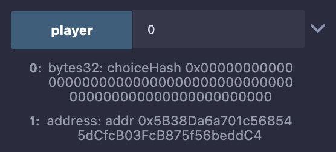
    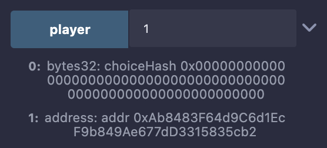

    สังเกตว่า choiceHash ยังเป็น 0 เนื่องจากผู้เล่นยังไม่ได้เลือก choice

    ผู้เล่น idx=0 เลือก 2 - air ด้วย salt 123

    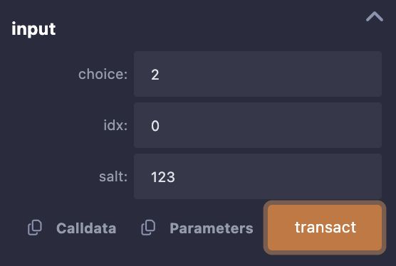
    

    ผู้เล่น idx=1 เลือก 4 - sponge ด้วย salt 321

    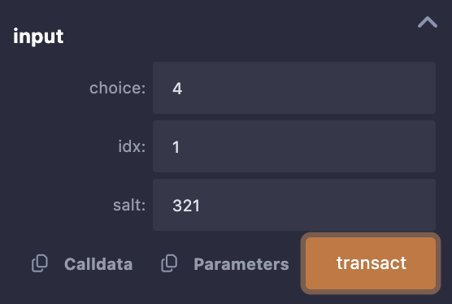
    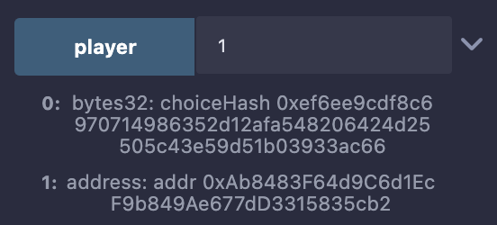

    ผู้ชนะคือผู้เล่น idx=1

    

    ผู้เล่น idx=1 เปิดเผย choice

    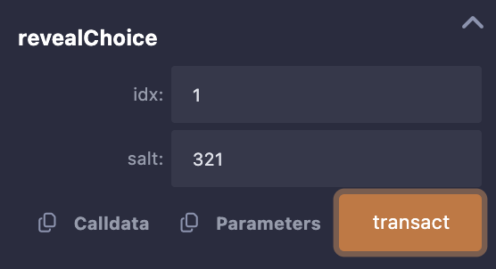

    จากนั้นเงินเดิมพันทั้งหมดจะโอนไปที่บัญชีของผู้เล่น idx=1

    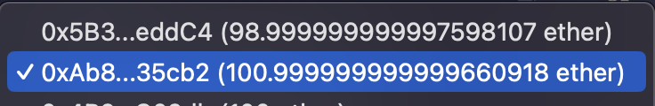

2. กรณีเสมอ กำหนดให้ผู้เล่นทั้ง 2 คนเลือก 6 - fire

    เมื่อผู้เล่นครบ 2 คน player เก็บค่าดังนี้

    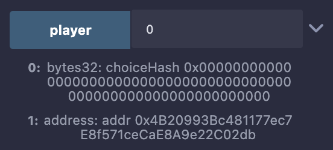
    

    สังเกตว่า choiceHash ยังเป็น 0 เนื่องจากผู้เล่นยังไม่ได้เลือก choice

    ผู้เล่น idx=0 เลือก 6 - fire ด้วย salt 456

    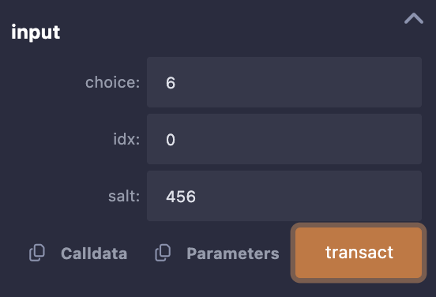
    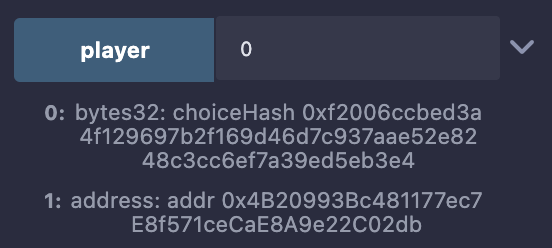

    ผู้เล่น idx=1 เลือก 6 - fire ด้วย salt 654

    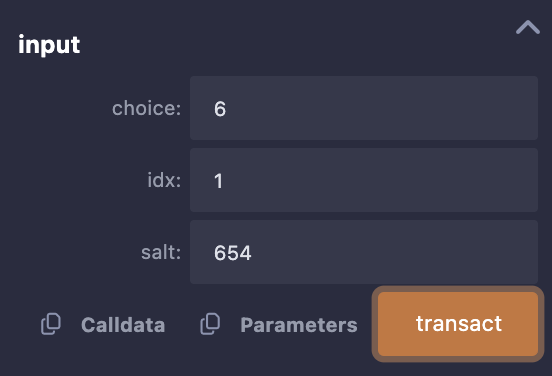
    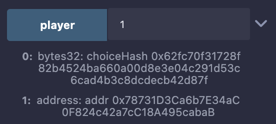

    ได้ผลเสมอกัน เงินเดิมพันจะโอนกลับไปที่บัญชีของผู้เล่นแต่ละคน

    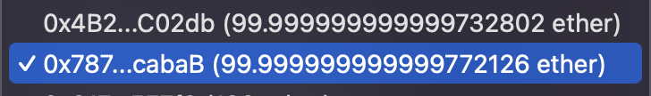